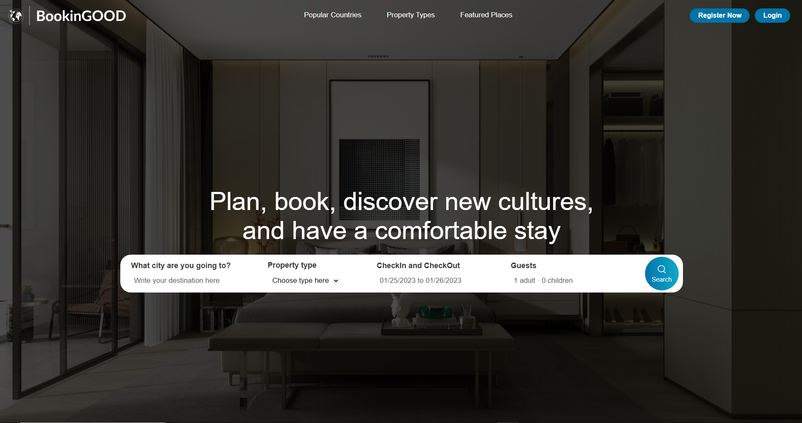

<h2 align="center">Full Stack MERN Responsive Booking App (Aplicativo de reservas) with a fully functional Admin Panel</h2>

### 📋 About the project

Você pode filtrar as propriedades disponíveis por:
cidade, tipos de propriedade, propriedades em destaque,
quarto mais barato (escolhendo o mínimo e máximo de preço a pagar)
e quantidade de hóspedes.

Sua reserva, assim como os valores dela serão estabelecidos com base no:
intervalo de datas escolhido e na quantidade/preço dos quartos.

---

    

### Para uma melhor experiência, teste você mesmo - [Booking App](https://abms-booking-app.onrender.com/)
---
### 🚀 Technologies

 <h2> For the Booking website </h2>

- [React.js](https://reactjs.org/)
- [React Router DOM](https://www.npmjs.com/package/react-router-dom)
- [Context API](https://reactjs.org/docs/context.html)
- [React Date Range](https://www.npmjs.com/package/react-date-range)
- [Axios](https://axios-http.com/ptbr/docs/intro)
- [MongoDB](https://www.mongodb.com/cloud)
- [mongoose](https://mongoosejs.com/)
- [Express](https://expressjs.com/pt-br/)
- [bcryptjs](https://www.npmjs.com/package/bcryptjs)
- [Cookie Parser](https://www.npmjs.com/package/cookie-parser)
- [JWT](https://www.npmjs.com/package/jsonwebtoken)

<h2> For the Dashboard </h2>

- [Sass](https://sass-lang.com/)
- [MUI-Icons](https://mui.com/material-ui/material-icons/)
- [MUI-Table](https://mui.com/material-ui/react-table/)
- [MUI-DataGrid](https://mui.com/pt/x/react-data-grid/)
- [Recharts](https://recharts.org/)
- [React Circular Progressbar](https://www.npmjs.com/package/react-circular-progressbar)

---
### 👉 [See my Linkedin](https://www.linkedin.com/in/alisson-modesto-fullstack-developer/)
